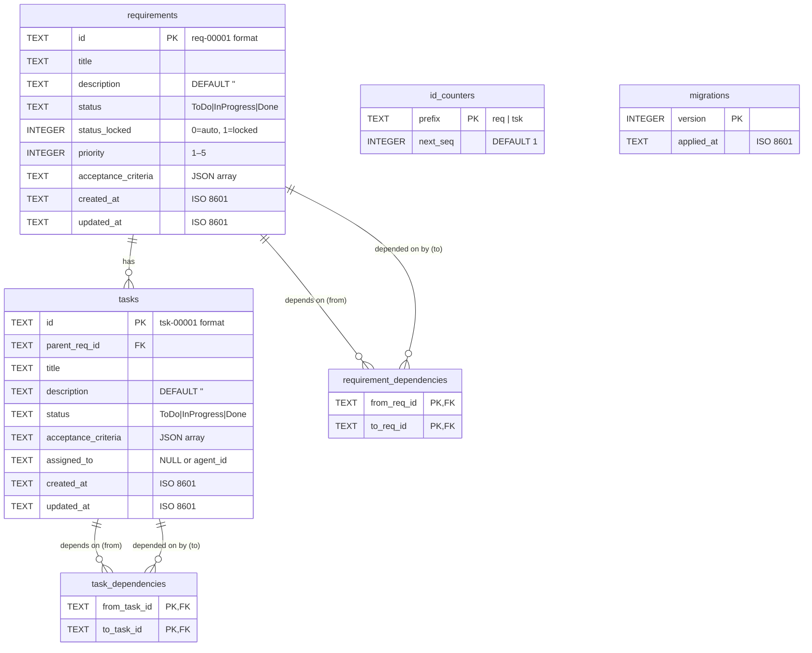

# MATRIX — Database Architecture

**Schema version:** v1  
**Engine:** SQLite (via Node.js `node:sqlite` built-in, `DatabaseSync` API)  
**ORM:** None — raw SQL prepared statements only

---

## ER Diagram



---

## File Location

| Setting      | Value                                                        |
| ------------ | ------------------------------------------------------------ |
| Default path | `.matrix/matrix.db` (relative to `cwd`)                      |
| Override     | `MATRIX_DB_PATH` environment variable (absolute or relative) |
| Directory    | Auto-created via `mkdirSync(..., { recursive: true })`       |
| Permissions  | `0o600` (owner read/write only) set on first creation        |

> **Security:** `MATRIX_DB_PATH` accepts absolute paths. Treat it as a trusted configuration value — do not derive it from untrusted user input.

---

## Tables

### `migrations`

Tracks which migration versions have been applied. Acts as a guard in `runMigrations()` — versions already recorded here are skipped on startup.

| Column       | Type    | Constraints                   |
| ------------ | ------- | ----------------------------- |
| `version`    | INTEGER | PRIMARY KEY                   |
| `applied_at` | TEXT    | NOT NULL — ISO 8601 timestamp |

**Rule:** Never modify an existing `MIGRATIONS` entry. Append new ones only. The `version` integer is the sole ordering key.

**Atomicity:** Each migration is applied in its own `BEGIN`/`COMMIT`/`ROLLBACK` block — the migration SQL and the corresponding `INSERT INTO migrations` succeed or fail together. A crash mid-migration leaves no partial record, so the migration will be retried on next startup.

---

### `id_counters`

Stores the next available sequence number for each entity type. Pre-seeded with `req=1` and `tsk=1`.

| Column     | Type    | Constraints                      |
| ---------- | ------- | -------------------------------- |
| `prefix`   | TEXT    | PRIMARY KEY — `'req'` or `'tsk'` |
| `next_seq` | INTEGER | NOT NULL, DEFAULT 1              |

**Allocation pattern:** IDs are claimed with a single atomic statement:

```sql
UPDATE id_counters
SET next_seq = next_seq + 1
WHERE prefix = ?
RETURNING next_seq - 1 AS seq
```

The `RETURNING` clause makes the read-then-increment atomic under SQLite's serialised write lock. The returned `seq` is formatted as a zero-padded 5-digit string: `req-00001`, `tsk-00042`. Counters only increment — IDs are never reused after deletion.

---

### `requirements`

Core entity. A requirement captures a product-level goal and owns zero or more tasks.

| Column                | Type    | Constraints                                                               | Notes                                          |
| --------------------- | ------- | ------------------------------------------------------------------------- | ---------------------------------------------- |
| `id`                  | TEXT    | PRIMARY KEY                                                               | Format: `req-00001`                            |
| `title`               | TEXT    | NOT NULL                                                                  |                                                |
| `description`         | TEXT    | NOT NULL, DEFAULT `''`                                                    |                                                |
| `status`              | TEXT    | NOT NULL, DEFAULT `'ToDo'`, CHECK IN (`'ToDo'`, `'InProgress'`, `'Done'`) |                                                |
| `status_locked`       | INTEGER | NOT NULL, DEFAULT `0`, CHECK IN (`0`, `1`)                                | `1` = manually overridden; `0` = auto-computed |
| `priority`            | INTEGER | NOT NULL, DEFAULT `3`, CHECK BETWEEN `1` AND `5`                          | 1 = highest, 5 = lowest                        |
| `acceptance_criteria` | TEXT    | NOT NULL, DEFAULT `'[]'`                                                  | JSON array of strings                          |
| `created_at`          | TEXT    | NOT NULL                                                                  | ISO 8601                                       |
| `updated_at`          | TEXT    | NOT NULL                                                                  | ISO 8601                                       |

**Status auto-computation:** When `status_locked = 0`, the application layer derives `status` from the aggregate state of the requirement's tasks (all Done → Done, any InProgress → InProgress, otherwise ToDo). When a user manually sets status via `update_requirement`, the application sets `status_locked = 1` to suppress future recomputation. Resetting status to `'ToDo'` clears the lock.

---

### `tasks`

A task is an atomic unit of work that belongs to exactly one requirement. Tasks cannot exist without their parent.

| Column                | Type | Constraints                                                               | Notes                        |
| --------------------- | ---- | ------------------------------------------------------------------------- | ---------------------------- |
| `id`                  | TEXT | PRIMARY KEY                                                               | Format: `tsk-00001`          |
| `parent_req_id`       | TEXT | NOT NULL, FK → `requirements(id)` ON DELETE CASCADE                       |                              |
| `title`               | TEXT | NOT NULL                                                                  |                              |
| `description`         | TEXT | NOT NULL, DEFAULT `''`                                                    |                              |
| `status`              | TEXT | NOT NULL, DEFAULT `'ToDo'`, CHECK IN (`'ToDo'`, `'InProgress'`, `'Done'`) |                              |
| `acceptance_criteria` | TEXT | NOT NULL, DEFAULT `'[]'`                                                  | JSON array of strings        |
| `assigned_to`         | TEXT | NULL = unassigned                                                         | Agent ID string when claimed |
| `created_at`          | TEXT | NOT NULL                                                                  | ISO 8601                     |
| `updated_at`          | TEXT | NOT NULL                                                                  | ISO 8601                     |

**Cascade behaviour:** Deleting a requirement deletes all its tasks via `ON DELETE CASCADE`.

---

### `requirement_dependencies`

Junction table encoding a directed "depends on" graph between requirements.

| Column           | Type | Constraints                                              |
| ---------------- | ---- | -------------------------------------------------------- |
| `from_req_id`    | TEXT | NOT NULL, FK → `requirements(id)` ON DELETE **CASCADE**  |
| `to_req_id`      | TEXT | NOT NULL, FK → `requirements(id)` ON DELETE **RESTRICT** |
| _(composite PK)_ |      | PRIMARY KEY (`from_req_id`, `to_req_id`)                 |

**Semantics:** `from_req_id` depends on `to_req_id` — the "from" requirement is blocked until the "to" requirement reaches `Done`.

**Delete behaviour:**

- `ON DELETE CASCADE` on `from_req_id`: deleting requirement A automatically removes all rows where A is the dependent (the "A depends on B" relationships disappear with A).
- `ON DELETE RESTRICT` on `to_req_id`: the database prevents deleting requirement B while any other requirement still depends on it. This enforces the `HAS_DEPENDENTS` business rule at the storage layer without application code.

---

### `task_dependencies`

Junction table encoding a directed "depends on" graph between tasks.

| Column           | Type | Constraints                                       |
| ---------------- | ---- | ------------------------------------------------- |
| `from_task_id`   | TEXT | NOT NULL, FK → `tasks(id)` ON DELETE **CASCADE**  |
| `to_task_id`     | TEXT | NOT NULL, FK → `tasks(id)` ON DELETE **RESTRICT** |
| _(composite PK)_ |      | PRIMARY KEY (`from_task_id`, `to_task_id`)        |

**Semantics:** `from_task_id` depends on `to_task_id` — identical CASCADE/RESTRICT pattern to `requirement_dependencies`.

**Scope constraint:** Cross-requirement task dependencies are not permitted. This is enforced at the application layer (both tasks must share the same `parent_req_id`), not at the DB level, to avoid the complexity of a multi-column FK check.

---

## Indexes

| Index                              | Table                      | Columns              | Purpose                                                                                                                          |
| ---------------------------------- | -------------------------- | -------------------- | -------------------------------------------------------------------------------------------------------------------------------- |
| `idx_tasks_parent`                 | `tasks`                    | `(parent_req_id)`    | Efficient `list_tasks` queries filtering by parent requirement                                                                   |
| `idx_requirements_priority_status` | `requirements`             | `(priority, status)` | `list_requirements` sorted by priority; `next_task` unblocking queries that filter on status                                     |
| `idx_tasks_status`                 | `tasks`                    | `(status)`           | Filter tasks by status across all requirements                                                                                   |
| `idx_req_deps_to`                  | `requirement_dependencies` | `(to_req_id)`        | Reverse lookup — "who depends on requirement X?" — used for `HAS_DEPENDENTS` checks, cycle detection, and `next_task` unblocking |
| `idx_task_deps_to`                 | `task_dependencies`        | `(to_task_id)`       | Reverse lookup — "who depends on task X?" — same use cases as above                                                              |

The two reverse-lookup indexes (`idx_req_deps_to`, `idx_task_deps_to`) are the most important: without them, every `HAS_DEPENDENTS` check and every step of a cycle-detection CTE degrades to a full table scan on the dependency junction tables.

---

## Transactions

Write operations that mutate multiple tables, or combine a data change with a status recompute, are wrapped in explicit `BEGIN`/`COMMIT`/`ROLLBACK` blocks:

| Operation                                                     | What is atomic                                    |
| ------------------------------------------------------------- | ------------------------------------------------- |
| `pickTask`, `completeTask`, `releaseTask`, `forceReleaseTask` | Task status update + `recomputeRequirementStatus` |
| `deleteTask`                                                  | Task deletion + `recomputeRequirementStatus`      |
| Each migration in `runMigrations`                             | Migration SQL + `INSERT INTO migrations` record   |

Read operations and single-statement writes rely on SQLite's implicit per-statement transactions.

---

## SQLite Pragmas

Applied at every connection open, before any query:

| Pragma         | Value  | Reason                                                                                                                                                                                                                                        |
| -------------- | ------ | --------------------------------------------------------------------------------------------------------------------------------------------------------------------------------------------------------------------------------------------- |
| `journal_mode` | `WAL`  | Write-Ahead Logging allows multiple concurrent readers alongside one writer without readers blocking writers or vice versa. Essential for multi-process MCP stdio agents that each open their own `DatabaseSync` connection to the same file. |
| `foreign_keys` | `ON`   | SQLite disables foreign key enforcement by default. This pragma enables the `ON DELETE CASCADE` / `ON DELETE RESTRICT` behaviours defined in the schema. Must be set per connection — it is not persisted in the database file.               |
| `busy_timeout` | `5000` | When a write lock is held by another process, SQLite will retry for up to 5 000 ms before throwing `SQLITE_BUSY`. Prevents spurious failures under light write contention without requiring application-level retry logic.                    |

---

## Key Design Decisions

### 1. Junction tables over JSON columns for dependencies

**Rejected alternative:** Store dependency lists as a JSON array of IDs inside a column on `requirements` or `tasks`.

**Why rejected:**

- Reverse lookup ("which requirements depend on X?") would require a full table scan with `json_each()` — no index is possible on a JSON value.
- `ON DELETE RESTRICT` cannot be expressed on a value embedded in JSON; the database has no way to enforce referential integrity across JSON content.
- Cycle detection via recursive CTEs (`WITH RECURSIVE`) requires a proper table with indexed columns to be efficient and correct; an application-side graph walk over JSON would need to load the entire dependency graph into memory.

**Outcome:** Junction tables give O(log n) indexed reverse lookups, DB-enforced referential integrity, and enable efficient recursive CTEs for cycle detection.

---

### 2. Atomic sequential IDs via `id_counters`

**Rejected alternative:** `SELECT MAX(id) + 1` or `SELECT COUNT(*) + 1`.

**Why rejected:** Both are read-then-write operations — between the `SELECT` and the `INSERT`, a concurrent writer can claim the same number. Under WAL mode with multiple processes, this race is real.

**Outcome:** A single `UPDATE ... RETURNING` is atomic within SQLite's serialised write lock. The counter only ever increments, so IDs are never reused after deletion. Zero-padding to 5 digits ensures lexicographic sort order matches insertion order.

---

### 3. `status_locked` flag on requirements

**Context:** Requirement `status` is derived from the aggregate state of its tasks. Fully automated status avoids stale values, but sometimes a human (or agent) needs to set status independently of task state — e.g., marking a requirement `Done` before all tasks are closed.

**Mechanism:**

- `status_locked = 0` → status is auto-computed from tasks on every task update.
- `status_locked = 1` → auto-computation is suppressed; the stored value is used as-is.
- Explicitly setting status to `'ToDo'` via `update_requirement` clears the lock (resets to `0`), resuming auto-computation.

---

### 4. ISO 8601 text for timestamps

`node:sqlite`'s `DatabaseSync` API returns all column values as JavaScript primitives — it does not parse `DATETIME` columns into `Date` objects. Storing timestamps as ISO 8601 text (e.g., `2026-04-29T12:00:00.000Z`) ensures:

- Values are directly usable as strings in JavaScript without conversion.
- Lexicographic sort order matches chronological order.
- Human readability in the raw database file.

SQLite's numeric date storage (Julian Day Numbers or Unix epoch integers) would require explicit conversion at every read and write, adding friction with no benefit in this context.

---

### 5. `acceptance_criteria` as JSON text

**Why not a separate table?** Acceptance criteria are always read and written as a whole ordered list for a single entity. There is no requirement to query individual criteria in isolation, filter by criterion content, or reference criteria from other entities. A junction table would add a join to every read/write with no query benefit. JSON text is the correct fit here — unlike dependencies, criteria have no reverse-lookup need and no referential integrity requirement.

---

### 6. File permissions

On first creation, the database file is `chmod`'d to `0o600` (owner read/write only). This prevents other local users on a shared machine from reading project task data. The operation is best-effort — it is non-fatal on platforms where `chmod` is unavailable (e.g., some Windows configurations).

---

## Migration Strategy

Migrations are defined as an array of `{ version, sql }` objects in `src/db.js`:

```js
const MIGRATIONS = [
  { version: 1, sql: `...` },
  // future: { version: 2, sql: `ALTER TABLE ...` },
];
```

**Startup sequence:**

1. `openDatabase()` ensures the `migrations` table exists (idempotent bootstrap `CREATE TABLE IF NOT EXISTS`).
2. Queries all `version` values from `migrations` into a `Set`.
3. Iterates `MIGRATIONS` in order; skips any version already in the set.
4. Applies unapplied migrations with `db.exec(sql)` and records them in `migrations`.

**Rules for contributors:**

- **Never modify an existing migration.** If a migration has been applied to any database, changing it will silently diverge that database from the new definition. The version number will already be recorded as applied and the change will never run.
- **Always append new migrations** with the next integer version number.
- Migrations run in a single `db.exec()` call. Each statement executes in SQLite's autocommit mode — there is no implicit wrapping into a single transaction. Partial failure mid-migration is safe in practice because every `CREATE` statement uses `IF NOT EXISTS` and every `INSERT` uses `OR IGNORE`, so re-running on next startup leaves the database in a consistent state. WAL mode affects concurrent access, not single-connection autocommit behaviour.
