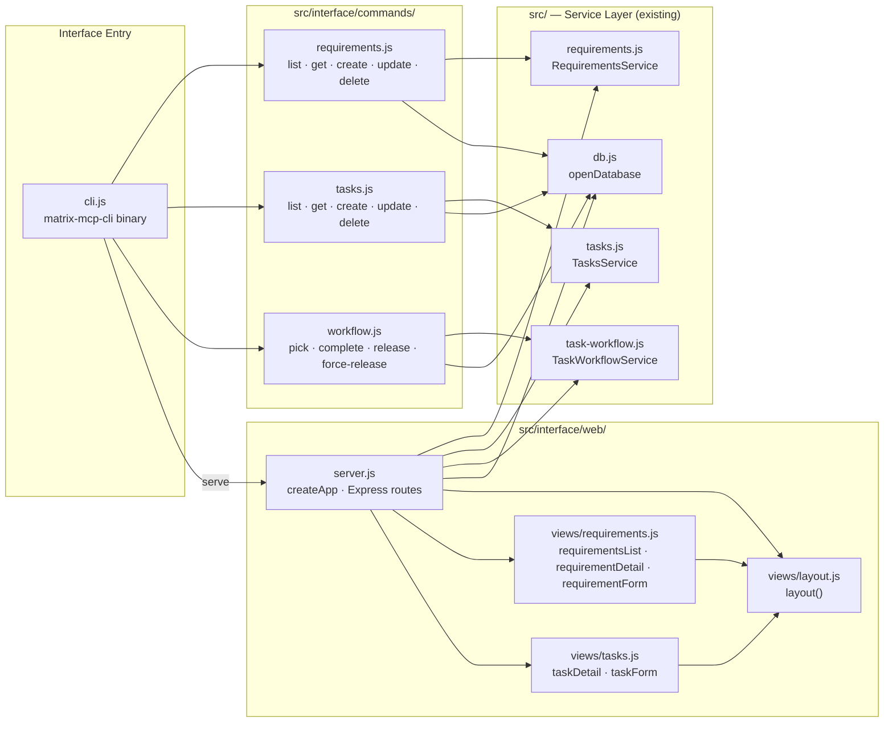
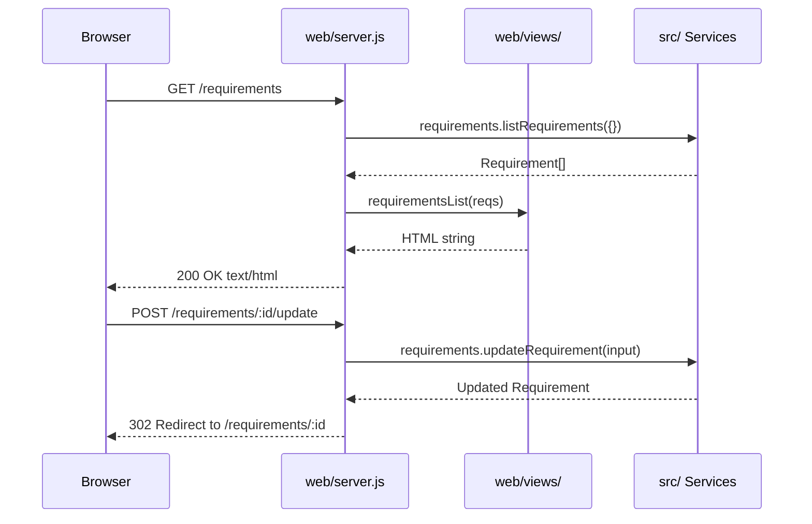

# MATRIX — Interface Architecture (CLI + Web UI)

This document describes the architecture of the `src/interface/` layer: a CLI binary (`matrix-mcp-cli`) and an embedded web server that allow human developers to interact with the MATRIX database without an MCP client.

All interface code is strictly isolated in `src/interface/`. It calls the existing service layer (`src/requirements.js`, `src/tasks.js`, `src/task-workflow.js`) and never issues raw SQL.

---

## Module Map



---

## File Structure

Every file Becky needs to create:

```
src/interface/
├── cli.js                          # Entry point; #!/usr/bin/env node; commander program
├── commands/
│   ├── requirements.js             # CLI handlers: list, get, create, update, delete requirements
│   ├── tasks.js                    # CLI handlers: list, get, create, update, delete tasks
│   ├── workflow.js                 # CLI handlers: pick, complete, release, force-release
│   └── utils.js                    # Shared handleError utility
└── web/
    ├── server.js                   # createApp(db) — Express app with all HTTP routes
    └── views/
        ├── layout.js               # layout(title, body) → full HTML page string
        ├── requirements.js         # requirementsList, requirementDetail, requirementForm
        └── tasks.js                # taskDetail, taskForm
```

**Total: 8 files.**

### File Responsibilities

| File                                  | Responsibility                                                                                                                                                                                                                           |
| ------------------------------------- | ---------------------------------------------------------------------------------------------------------------------------------------------------------------------------------------------------------------------------------------- |
| `src/interface/cli.js`                    | Defines the `commander` program, registers all subcommands, implements the `--matrix-db-path` global option, implements interactive menu mode (no-argument invocation). Calls `openDatabase()` from `src/db.js` after resolving DB path. |
| `src/interface/commands/requirements.js`  | Exports handler functions for each requirement command. Each handler receives a resolved `db` instance, calls service methods, and renders output to stdout (table / JSON).                                                              |
| `src/interface/commands/tasks.js`         | Same pattern as above, for task commands. The `list` sub-command requires a `--req <id>` option because `listTasks` requires `parentReqId`.                                                                                              |
| `src/interface/commands/workflow.js`      | Exports handlers for `pick`, `complete`, `release`, `force-release`. Each requires `--agent <id>` (except `force-release`).                                                                                                              |
| `src/interface/web/server.js`             | `export function createApp(db)` returns a configured Express app. All routes are registered here. The CLI calls `createApp(db).listen(port)`.                                                                                            |
| `src/interface/web/views/layout.js`       | `export function layout(title, body)` returns the full HTML page string. Imports Pico CSS from CDN.                                                                                                                                      |
| `src/interface/web/views/requirements.js` | View functions that return HTML strings: `requirementsList(reqs)`, `requirementDetail(req, tasks)`, `requirementForm(req?)`.                                                                                                             |
| `src/interface/web/views/tasks.js`        | View functions: `taskDetail(task, req)`, `taskForm(task?, parentReq)`.                                                                                                                                                                   |

---

## DB Resolution Logic

The interface layer adds a `--matrix-db-path` CLI option on top of the existing `MATRIX_DB_PATH` env var support in `src/db.js`.

**Resolution order (highest to lowest precedence):**

1. `--matrix-db-path <path>` CLI argument
2. `MATRIX_DB_PATH` environment variable
3. `.matrix/matrix.db` relative to `process.cwd()`

**Implementation strategy:** In `src/interface/cli.js`, a commander `preAction` hook fires before every command handler. If `--matrix-db-path` was provided, it writes the value to `process.env['MATRIX_DB_PATH']`. After the hook, each handler calls `openDatabase()` from `src/db.js`, which already reads `MATRIX_DB_PATH`. No DB resolution logic is duplicated.

```
// Pseudocode — src/interface/cli.js
program.option('--matrix-db-path <path>', 'Override database file path');

program.hook('preAction', () => {
  const { matrixDbPath } = program.opts();
  if (matrixDbPath) process.env['MATRIX_DB_PATH'] = matrixDbPath;
});
```

This hooks neatly into the existing `resolveDbPath()` in `src/db.js` and requires no modification to source files.

---

## CLI Design

### Binary Registration

In `package.json`, add:

```json
"bin": {
  "matrix-mcp": "./src/server.js",
  "matrix-mcp-cli":  "./src/interface/cli.js"
},
"files": [
  "src/"
]
```

### Command Structure

```
matrix-mcp-cli [--matrix-db-path <path>] <command> [options]

Commands:
  list [options]                    List requirements
    -s, --status <status>           Filter by status (ToDo | InProgress | Done)
    -p, --priority <n>              Filter by priority (1–5)

  list tasks --req <req-id>         List tasks for a requirement
    -s, --status <status>           Filter by status

  get <id>                          Get a requirement (req-NNNNN) or task (tsk-NNNNN) by ID

  create requirement                Interactive prompts to create a requirement
  create task --req <req-id>        Interactive prompts to create a task

  update <id>                       Interactive prompts to update a requirement or task
                                    (type is inferred from the ID prefix)

  delete <id>                       Delete a requirement or task (with confirmation prompt)
                                    (type is inferred from the ID prefix)

  pick <task-id> --agent <agent-id>           Pick a task (ToDo → InProgress)
  complete <task-id> --agent <agent-id>       Complete a task (InProgress → Done)
  release <task-id> --agent <agent-id>        Release a task (InProgress → ToDo)
  force-release <task-id>                     Force-release any InProgress task

  serve [options]                   Start the embedded web server
    -p, --port <n>                  Port to listen on (default: 3000)
```

**ID prefix detection:** Both `get`, `update`, and `delete` accept either `req-NNNNN` or `tsk-NNNNN`. The handler checks `id.startsWith('req-')` to dispatch to `RequirementsService` or `TasksService`.

### Interactive Mode (no-argument invocation)

When `matrix-mcp-cli` is invoked with no command, display a top-level `select` menu using `@inquirer/prompts`:

```
? What would you like to do?
❯ List requirements
  Get a requirement
  Create a requirement
  Update a requirement or task
  Delete a requirement or task
  Task workflow (pick / complete / release)
  Start web interface
  Exit
```

Each selection navigates to the appropriate sub-flow using follow-up prompts (e.g., an `input` prompt for an ID, a `select` for status). Interactive mode is implemented directly in `src/interface/cli.js` as the default action when no command is matched — commander's `.action()` on the root program.

### Output Formatting

- **List commands** — tabular output using `console.table()` or manually formatted column-aligned strings. No external table library.
- **Get commands** — key-value block output (multi-line, one field per line).
- **Mutations** — print the returned object (same as get), preceded by a `✓` success line.
- **Errors** — print `Error [CODE]: message` to stderr and exit with code 1.

---

## Web Server Design

### Overview

`src/interface/web/server.js` exports a single function:

```js
/**
 * @param {import('node:sqlite').DatabaseSync} db
 * @returns {import('express').Application}
 */
export function createApp(db) { ... }
```

The CLI's `serve` command calls:

```js
const db = openDatabase();
const app = createApp(db);
app.listen(port, () => console.log(`MATRIX UI running at http://localhost:${port}`));
```

The Express app uses `express.urlencoded({ extended: false })` for form parsing. No JSON body parser is needed for the server-rendered flow.

### Route Table

All mutations use `POST` (HTML forms support only GET and POST).

| Method | Path                             | Description                                   |
| ------ | -------------------------------- | --------------------------------------------- |
| `GET`  | `/`                              | Redirect 302 → `/requirements`                |
| `GET`  | `/requirements`                  | List all requirements                         |
| `GET`  | `/requirements/new`              | Create requirement form                       |
| `POST` | `/requirements`                  | Submit create requirement form                |
| `GET`  | `/requirements/:id`              | Requirement detail + its tasks                |
| `GET`  | `/requirements/:id/edit`         | Edit requirement form                         |
| `POST` | `/requirements/:id/update`       | Submit edit requirement form                  |
| `POST` | `/requirements/:id/delete`       | Delete requirement                            |
| `GET`  | `/requirements/:reqId/tasks/new` | Create task form (under a requirement)        |
| `POST` | `/requirements/:reqId/tasks`     | Submit create task form                       |
| `GET`  | `/tasks/:id`                     | Task detail                                   |
| `GET`  | `/tasks/:id/edit`                | Edit task form                                |
| `POST` | `/tasks/:id/update`              | Submit edit task form                         |
| `POST` | `/tasks/:id/delete`              | Delete task                                   |
| `POST` | `/tasks/:id/pick`                | Pick task — form includes `agentId` field     |
| `POST` | `/tasks/:id/complete`            | Complete task — form includes `agentId` field |
| `POST` | `/tasks/:id/release`             | Release task — form includes `agentId` field  |
| `POST` | `/tasks/:id/force-release`       | Force-release task                            |

**Note on workflow actions:** The task detail page (`GET /tasks/:id`) renders inline forms for each applicable workflow action. Each form has a single `agentId` text input (pre-filled from a cookie or left blank) plus a submit button. Workflow actions redirect back to the task detail page on success.

### Web Request Flow



### Rendering Approach

No template engine. All views are plain JS functions that return HTML strings via template literals:

```js
// src/interface/web/views/requirements.js
import { layout } from './layout.js';

export function requirementsList(reqs) {
  const rows = reqs.map((r) => `<tr>...</tr>`).join('');
  return layout('Requirements', `<table>${rows}</table>`);
}
```

`layout.js` produces the full HTML document with the Pico CSS CDN link, a `<nav>` with breadcrumb, and a `<main>` content area. This approach needs no compilation, no bundler, no runtime template engine dependency.

### Web Error Handling

Every route handler is wrapped in a try/catch. Errors are classified as:

| Error type                  | HTTP status | Response                                |
| --------------------------- | ----------- | --------------------------------------- |
| `MatrixError` (has `.code`) | 400         | Error page showing `code` and `message` |
| Any other `Error`           | 500         | Generic internal error page             |

The error page is rendered inline in `server.js` using the `layout()` function so it shares the same shell.

### Styling

[Pico CSS v2](https://picocss.com) loaded from CDN (classless semantic HTML). No npm dependency, no build step. The entire styling contract is: use semantic HTML elements (`<table>`, `<form>`, `<article>`, `<nav>`, `<header>`) and Pico handles the rest. No custom CSS is required for a functional UI.

---

## Library Choices

| Library             | Version   | Purpose                             | Rationale                                                                                                                                                                                                                         |
| ------------------- | --------- | ----------------------------------- | --------------------------------------------------------------------------------------------------------------------------------------------------------------------------------------------------------------------------------- |
| `commander`         | `^12.1.0` | CLI argument and subcommand parsing | Most widely-used Node CLI framework; zero dependencies; excellent ES module support; auto-generated help. The established default choice for Node CLIs.                                                                           |
| `@inquirer/prompts` | `^7.1.0`  | Interactive terminal prompts        | The official modern successor to `inquirer` (v9+ repackaged). ES module native; no CommonJS shim needed. Provides `input`, `select`, `confirm`, `number`, `checkbox` as individual named imports. Requires Node ≥ 18 (satisfied). |
| `express`           | `^4.21.0` | HTTP web server                     | Mature, minimal, well-known. Works with `import express from 'express'` in ESM. v4 is stable and avoids the minor breaking changes in v5. No compilation step needed; no bundler.                                                 |

**What was considered and rejected:**

- **Built-in `http` module** for the web server: workable but requires manually parsing URL params, query strings, and form bodies — adds 100+ lines of plumbing for no benefit over Express.
- **`fastify`**: faster than Express but adds complexity (schema-based validation, plugins) that isn't needed for a small server-rendered admin UI.
- **`eta` / `ejs`** template engines: add a dependency without meaningful benefit over template literals for this scale of UI.
- **`inquirer` (non-scoped)**: `@inquirer/prompts` is the recommended package from the same maintainers for new projects starting with ES modules.

---

## Service Integration

### Import Paths

From `src/interface/commands/*.js` and `src/interface/web/server.js`, the import paths to `src/` are:

```js
import { openDatabase }          from '../../db.js';
import { getRequirementsService } from '../../requirements.js';
import { getTasksService }        from '../../tasks.js';
import { getTaskWorkflowService } from '../../task-workflow.js';
```

### Instantiation Pattern

Each command handler and the web app receives a `db` instance (obtained by calling `openDatabase()`) and instantiates only the service(s) it needs:

```js
// Typical command handler
export async function listRequirements(options) {
  const db = openDatabase(); // path already resolved by preAction hook
  const svc = getRequirementsService(db);
  const reqs = svc.listRequirements({ status: options.status, priority: options.priority });
  // render to stdout ...
}
```

For the web server, all three services are instantiated once when `createApp(db)` is called and closed over by the route handlers:

```js
export function createApp(db) {
  const requirements = getRequirementsService(db);
  const tasks = getTasksService(db);
  const workflow = getTaskWorkflowService(db);
  // routes close over these instances
}
```

### Error Handling

Service methods throw `MatrixError` (an `Error` with a `.code: MatrixErrorCode` property). Interface code should check `err.code` to produce user-facing messages:

```js
try {
  svc.getRequirement({ id });
} catch (err) {
  if (err.code === 'NOT_FOUND') {
    console.error(`Error: requirement ${id} not found`);
    process.exit(1);
  }
  throw err; // re-throw unexpected errors
}
```

---

## Conventions Specific to `interface/`

1. **No raw SQL.** All DB access goes through `getRequirementsService`, `getTasksService`, or `getTaskWorkflowService`. The `db` instance is passed to service factories only.
2. **No Zod schemas in interface code.** Input validation is the service layer's responsibility. Interface code passes plain objects; if the service throws `INVALID_INPUT`, display the message.
3. **ES Modules.** All files use `import`/`export`. No `require()`.
4. **JSDoc annotations** for all exported functions (param types, return types). No TypeScript compilation step.
5. **No test coverage requirement yet.** The interface layer is not unit-tested in the initial implementation (see REQ-008 for test coverage scope).
6. **CLI output to stdout; errors to stderr.** Use `console.log` for normal output and `console.error` for errors. Exit code 0 on success, 1 on error.
7. **Web views are pure functions.** View functions in `interface/web/views/` have no side effects — they receive data and return an HTML string. No global state.
8. **`createApp` is a factory, not a singleton.** This makes the web server testable in isolation if integration tests are added later (REQ-008).

---

## `package.json` Changes Required

Becky will need to make the following changes to `package.json`:

**`bin` field** — add the new binary:

```json
"bin": {
  "matrix-mcp": "./src/server.js",
  "matrix-mcp-cli":  "./interface/cli.js"
}
```

**`files` field** — include the new folder:

```json
"files": [
  "src/",
  "interface/"
]
```

**`dependencies`** — add three new runtime dependencies:

```json
"commander":        "^12.1.0",
"@inquirer/prompts": "^7.1.0",
"express":          "^4.21.0"
```

No changes to `devDependencies` are needed. The existing vitest setup and TypeScript config are unaffected.

---

## Open Questions

None at this time. All design decisions are resolved within the scope of REQ-012 and REQ-013.
