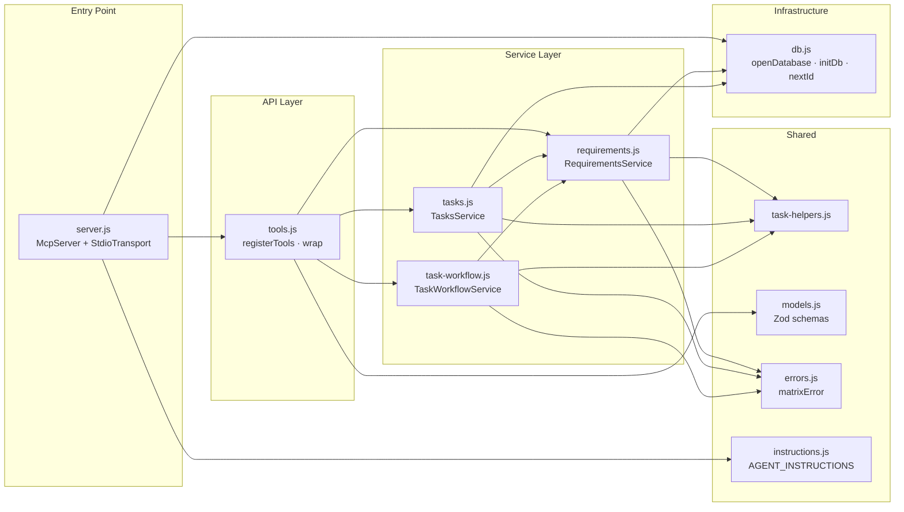

# MATRIX — System Overview

MATRIX is a local MCP server (Node.js + SQLite) that exposes 16 tools for requirement and task management in multi-agent workflows. It communicates over stdio and is distributed as an npm package invoked via `npx matrix-mcp`.

---

## Runtime Model

| Property     | Value                                                         |
| ------------ | ------------------------------------------------------------- |
| Transport    | `StdioServerTransport` (stdin/stdout)                         |
| Entry point  | `src/server.js` (bin: `matrix-mcp`)                           |
| Distribution | `npx matrix-mcp` (no global install needed)                   |
| Node.js      | `>=22.5.0` (requires `node:sqlite` built-in, added in 22.5.0) |
| Database     | SQLite at `.matrix/matrix.db` (per project)                   |
| SDK          | `@modelcontextprotocol/sdk` v1                                |

---

## Module Map



---

## Tool Catalogue

All tools are registered by `registerTools()` in `src/tools.js`. Inputs are validated by Zod schemas in `src/models.js`.

### Requirements (5 tools)

| Tool                 | Service method                   | Notes                                                 |
| -------------------- | -------------------------------- | ----------------------------------------------------- |
| `create_requirement` | `requirements.createRequirement` | Returns created requirement with auto-ID              |
| `update_requirement` | `requirements.updateRequirement` | Setting status locks/unlocks `status_locked`          |
| `delete_requirement` | `requirements.deleteRequirement` | Cascades to child tasks; blocked by `HAS_DEPENDENTS`  |
| `get_requirement`    | `requirements.getRequirement`    | Returns one requirement or `NOT_FOUND`                |
| `list_requirements`  | `requirements.listRequirements`  | Sorted by priority asc; filterable by status/priority |

### Tasks (5 tools)

| Tool          | Service method     | Notes                                             |
| ------------- | ------------------ | ------------------------------------------------- |
| `create_task` | `tasks.createTask` | Must reference an existing `parent_req_id`        |
| `update_task` | `tasks.updateTask` | Cannot change `status` or `assigned_to`           |
| `delete_task` | `tasks.deleteTask` | Blocked if task is InProgress or has dependents   |
| `get_task`    | `tasks.getTask`    | Returns one task or `NOT_FOUND`                   |
| `list_tasks`  | `tasks.listTasks`  | Filtered by `parent_req_id`; optionally by status |

### Workflow (4 tools)

| Tool                 | Service method              | Notes                                             |
| -------------------- | --------------------------- | ------------------------------------------------- |
| `pick_task`          | `workflow.pickTask`         | ToDo → InProgress; checks task + req dependencies |
| `complete_task`      | `workflow.completeTask`     | InProgress → Done; triggers requirement recompute |
| `release_task`       | `workflow.releaseTask`      | InProgress → ToDo; agent voluntarily releases     |
| `force_release_task` | `workflow.forceReleaseTask` | InProgress → ToDo; admin override, any agent      |

### Recommendation (1 tool)

| Tool        | Service method   | Notes                                                   |
| ----------- | ---------------- | ------------------------------------------------------- |
| `next_task` | `tasks.nextTask` | Returns highest-priority unblocked ToDo task, or `null` |

---

## Error Handling

All tool handlers are wrapped by `wrap()` in `src/tools.js`. On success the result is serialized to JSON; on any thrown error a structured MCP error response is returned:

```json
{
  "isError": true,
  "content": [{ "type": "text", "text": "{\"code\":\"NOT_FOUND\",\"message\":\"...\"}" }]
}
```

Domain errors are created by `matrixError(code, message)` in `src/errors.js`, which augments a standard `Error` with a `.code` property. Unrecognised errors fall back to `INTERNAL_ERROR`.

### Error Codes

| Code                         | Meaning                                                               |
| ---------------------------- | --------------------------------------------------------------------- |
| `NOT_FOUND`                  | Entity does not exist                                                 |
| `INVALID_INPUT`              | Input failed validation                                               |
| `TASK_NOT_OPEN`              | `pick_task` called on a non-ToDo task                                 |
| `TASK_NOT_IN_PROGRESS`       | Workflow tool called on a task that is not InProgress                 |
| `NOT_OWNER`                  | Agent is not the assigned owner of the task                           |
| `DEPENDENCIES_NOT_SATISFIED` | Task or requirement dependencies are not all Done                     |
| `CIRCULAR_DEPENDENCY`        | Adding a dependency would create a cycle (BFS detection)              |
| `INVALID_DEPENDENCY`         | Dependency references a non-existent entity or crosses requirements   |
| `DUPLICATE_DEPENDENCY`       | Dependency already exists                                             |
| `INVALID_STATUS`             | Status transition is not permitted (e.g. setting InProgress manually) |
| `HAS_DEPENDENTS`             | Deletion blocked because other entities depend on this one            |
| `INTERNAL_ERROR`             | Unexpected error not covered by the above codes                       |
