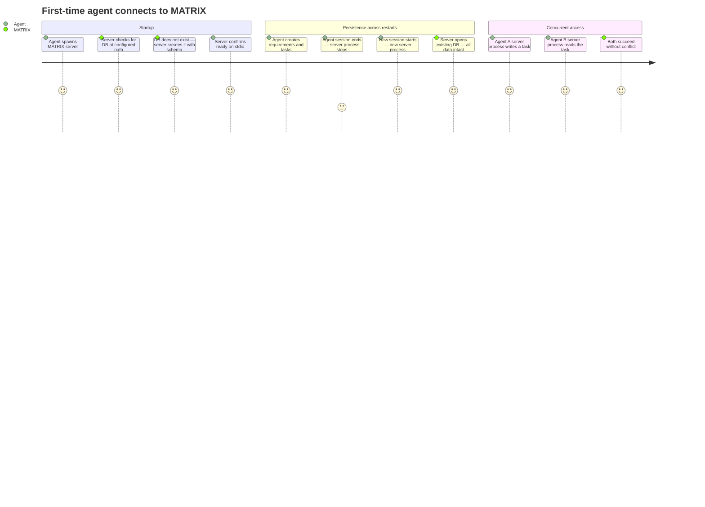

# REQ-001: Data Persistence & Configuration

**Status:** Done
**Priority:** P0
**Created:** 2026-04-29
**Updated:** 2026-04-29

## Non-Functional

## What

All requirements and tasks persist across server process restarts. The storage location is configurable via a `MATRIX_DB_PATH` environment variable, defaulting to `.matrix/matrix.db` relative to the working directory. Multiple server processes can safely read and write the same database concurrently without data corruption.

## Why

Agents work across multiple sessions — a requirement created in one session must be available in the next. Multi-agent workflows mean multiple server processes may access the same database simultaneously (each agent spawns its own stdio server process). Without safe concurrent access, agents would silently corrupt each other's work.

## User Journey

## Definition of Done

- [x] Data written via any tool persists after the server process exits and restarts
- [x] Database file defaults to `.matrix/matrix.db` relative to the server's working directory
- [x] Database location is overridable via `MATRIX_DB_PATH` environment variable (absolute or relative path)
- [x] `.matrix/` directory is created automatically if it does not exist
- [x] Database schema is created automatically on first run — no manual migration step required
- [x] Multiple server processes can concurrently read and write the same database file without data corruption or lock errors
- [x] Database file permissions are restricted to the current user (not world-readable)

## Open Questions

None.

## Notes

- The decision to use SQLite or another embedded database is an implementation choice — this requirement specifies the persistence _behaviour_, not the technology.
- The `MATRIX_DB_PATH` env var is part of the user-facing API and should be documented in the MCP server instructions.
