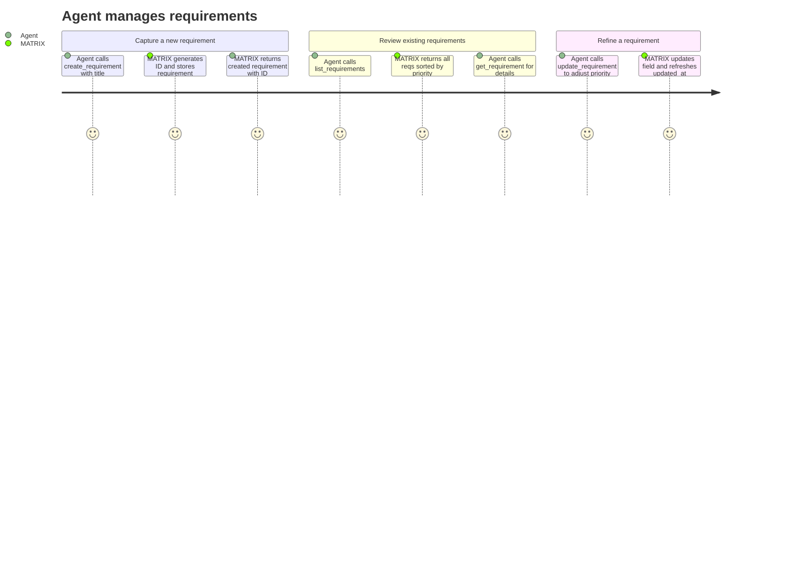

# REQ-002: Requirement Management

**Status:** Done
**Priority:** P0
**Created:** 2026-04-29
**Updated:** 2026-04-29

## Functional

## What

Agents can create, retrieve, list, and update requirements through four MCP tools: `create_requirement`, `get_requirement`, `list_requirements`, and `update_requirement`.

Each requirement has the following fields:

- **id** — auto-generated, sequential format: `req-00001`, `req-00002`, etc. Never reused.
- **title** — short, descriptive name (required on creation)
- **description** — full detail of what is needed
- **status** — `"ToDo"` | `"InProgress"` | `"Done"` (see REQ-006 for computation rules)
- **priority** — integer 1–5 (1 = highest). Default: 3
- **dependencies** — array of requirement IDs this req is blocked by
- **acceptance_criteria** — definition of done for the requirement as a whole
- **created_at** — ISO 8601 timestamp, set on creation
- **updated_at** — ISO 8601 timestamp, refreshed on every update

## Why

Requirements are the top-level unit of work. Before any tasks can be created or executed, agents need to capture, organise, and refine requirements. This is the entry point for all work in MATRIX — without it, agents have nothing to coordinate around.

## User Journey

## Definition of Done

- [x] `create_requirement` accepts title, description, priority (1–5), acceptanceCriteria, dependencies — all required (arrays may be []); returns the created requirement with auto-generated ID
- [x] Requirement IDs are sequential (`req-00001`, `req-00002`, ...) and never reused, even after deletion
- [x] `get_requirement` returns a single requirement by ID, or an error if not found
- [x] `list_requirements` returns all requirements sorted by priority (1 first)
- [x] `list_requirements` supports optional filters: status (`"ToDo"` | `"InProgress"` | `"Done"`), priority (1–5)
- [x] `update_requirement` can modify title, description, priority, dependencies, acceptance_criteria
- [x] `update_requirement` can set status to `"Done"` or `"ToDo"` (manual override — see REQ-006)
- [x] `update_requirement` rejects setting status to `"InProgress"` (always auto-computed)
- [x] `created_at` is set on creation; `updated_at` is refreshed on every mutation
- [x] All four tools are registered as MCP tools with Zod-validated input schemas
- [x] All four tools return the full requirement object on success

## Open Questions

None.

## Notes

- Dependency _validation_ (cycle detection, existence checks) is covered by REQ-005. This requirement covers storing the dependency array; REQ-005 covers enforcing it.
- Status auto-computation logic is covered by REQ-006. This requirement covers the manual override capability via `update_requirement`.
