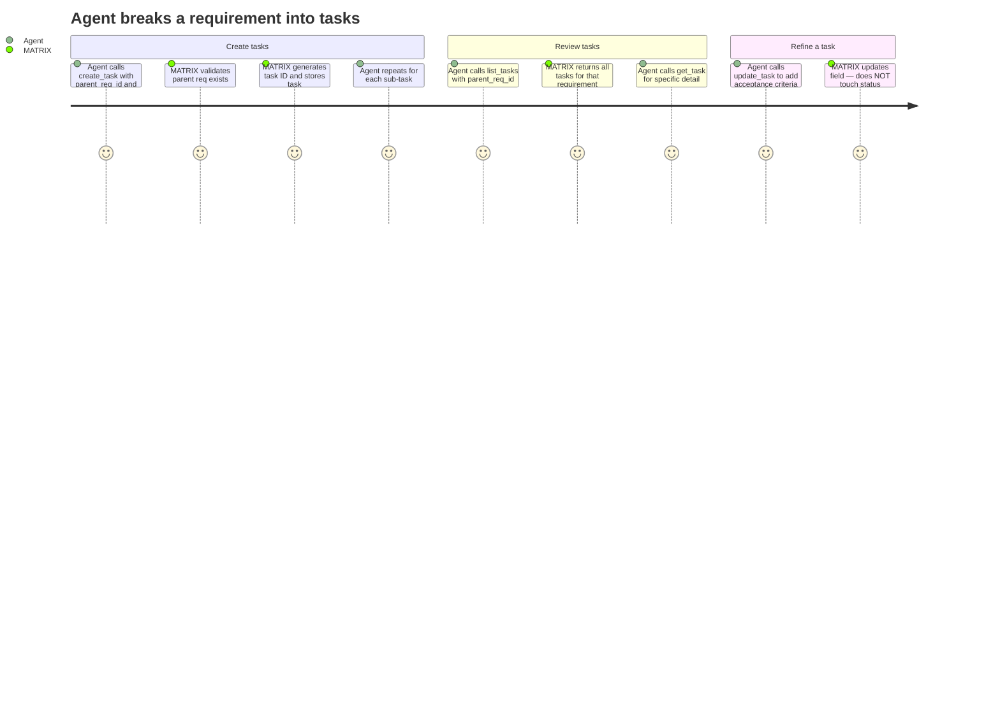

# REQ-003: Task Management

**Status:** Done
**Priority:** P0
**Created:** 2026-04-29
**Updated:** 2026-04-29

## Functional

Depends on: REQ-002

## What

Agents can create, retrieve, list, and update tasks under requirements through four MCP tools: `create_task`, `get_task`, `list_tasks`, and `update_task`.

Each task has the following fields:

- **id** — auto-generated, sequential format: `tsk-00001`, `tsk-00002`, etc. Never reused.
- **title** — short, descriptive name (required on creation)
- **description** — implementation detail
- **status** — `"ToDo"` | `"InProgress"` | `"Done"` (managed exclusively by workflow tools — see REQ-004)
- **parent_req_id** — the requirement this task belongs to (required, immutable after creation)
- **acceptance_criteria** — specific, testable criteria for this task
- **dependencies** — array of task IDs within the same parent requirement
- **assigned_to** — agent_id of the current owner, or null (managed by workflow tools)
- **created_at** — ISO 8601 timestamp, set on creation
- **updated_at** — ISO 8601 timestamp, refreshed on every update

## Why

Tasks are the actionable units of work. Requirements describe _what_ needs to happen; tasks break that down into discrete, assignable pieces that agents pick up and execute. Without task management, agents have no way to divide work or track granular progress.

## User Journey

## Definition of Done

- [x] `create_task` accepts parent_req_id (required), title (required), description, acceptance_criteria, dependencies and returns the created task
- [x] `create_task` fails with an error if parent_req_id does not reference an existing requirement
- [x] Task IDs are sequential (`tsk-00001`, `tsk-00002`, ...) and never reused, even after deletion
- [x] `parent_req_id` is immutable — cannot be changed after creation
- [x] New tasks default to status `"ToDo"` and assigned_to `null`
- [x] `get_task` returns a single task by ID, or an error if not found
- [x] `list_tasks` requires parent_req_id and returns all tasks for that requirement
- [x] `list_tasks` supports optional filter: status (`"ToDo"` | `"InProgress"` | `"Done"`)
- [x] `update_task` can modify title, description, acceptance_criteria, dependencies
- [x] `update_task` does NOT allow changing status or assigned_to (those are managed by pick/complete/release — REQ-004)
- [x] `update_task` rejects dependencies that reference task IDs outside the same parent requirement
- [x] All four tools are registered as MCP tools with Zod-validated input schemas
- [x] All four tools return the full task object on success

## Open Questions

None.

## Notes

- Task status transitions are exclusively handled by REQ-004 (Task Workflow).
- Dependency validation (cycle detection, existence checks, same-parent enforcement) is detailed in REQ-005.
