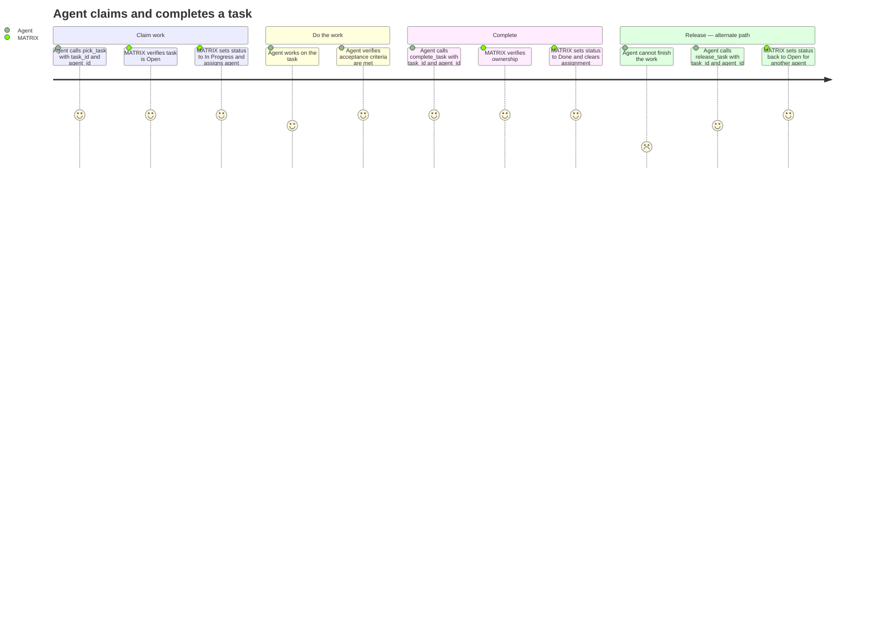

# REQ-004: Task Workflow

**Status:** Done
**Priority:** P0
**Created:** 2026-04-29
**Updated:** 2026-04-29

## Functional

Depends on: REQ-003

## What

Agents can claim, complete, and release tasks through three MCP tools: `pick_task`, `complete_task`, and `release_task`. Task ownership is enforced via `agent_id` — only the agent that picked a task can complete or release it.

**pick_task(task_id, agent_id)**

- Sets task status to `"InProgress"` and `assigned_to` to the provided `agent_id`.
- Fails if the task is not `"ToDo"`.

**complete_task(task_id, agent_id)**

- Sets task status to `"Done"` and clears `assigned_to`.
- Fails if the task is not `"InProgress"` or if `agent_id` does not match `assigned_to`.

**release_task(task_id, agent_id)**

- Sets task status back to `"ToDo"` and clears `assigned_to`.
- Fails if the task is not `"InProgress"` or if `agent_id` does not match `assigned_to`.

## Why

Multi-agent coordination requires exclusive task ownership. Without locking, two agents could work on the same task simultaneously, wasting effort and creating conflicts. The pick/complete/release cycle gives agents a clear protocol: claim work before starting, signal when done, and release if you can't finish — so another agent can take over.

## User Journey

## Definition of Done

- [x] `pick_task` requires task_id and agent_id parameters
- [x] `pick_task` sets task status to `"InProgress"` and `assigned_to` to agent_id
- [x] `pick_task` fails if task status is not `"ToDo"`
- [x] `complete_task` requires task_id and agent_id parameters
- [x] `complete_task` sets task status to `"Done"` and clears `assigned_to` to null
- [x] `complete_task` fails if task status is not `"InProgress"`
- [x] `complete_task` fails if agent_id does not match the task's current `assigned_to`
- [x] `release_task` requires task_id and agent_id parameters
- [x] `release_task` sets task status to `"ToDo"` and clears `assigned_to` to null
- [x] `release_task` fails if task status is not `"InProgress"`
- [x] `release_task` fails if agent_id does not match the task's current `assigned_to`
- [x] All three tools return the updated full task object on success
- [x] All three tools are registered as MCP tools with Zod-validated input schemas

## Open Questions

None.

## Notes

- Dependency checks on `pick_task` (blocked by unfinished dependency tasks or requirement-level dependencies) are covered by REQ-005. This requirement covers the core status transitions and ownership enforcement only.
- Requirement status recomputation triggered by `complete_task` and `release_task` is covered by REQ-006.
- Recovery of stale locks (agent crashed without releasing) is covered by REQ-010 (force_release_task).
