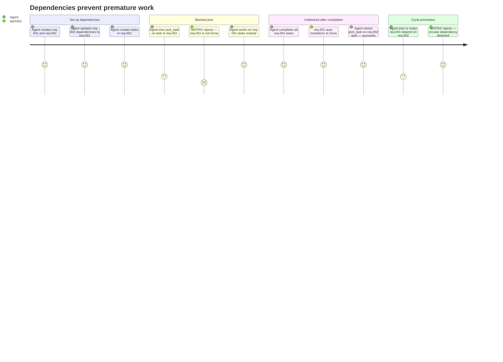

# REQ-005: Dependency Management

**Status:** Done
**Priority:** P0
**Created:** 2026-04-29
**Updated:** 2026-04-29

## Functional

Depends on: REQ-002, REQ-003, REQ-004

## What

Requirements can depend on other requirements. Tasks can depend on other tasks within the same parent requirement. The system enforces dependencies at two points:

1. **At creation/update time** — Validates that referenced IDs exist, that task dependencies stay within the same requirement, and that no circular dependency would be created.
2. **At pick time** — `pick_task` refuses to assign a task if its dependency tasks are not all `"Done"`, or if its parent requirement's dependency requirements are not all `"Done"`.

### Dependency rules

- A requirement's `dependencies` array may reference any other requirement ID in the system.
- A task's `dependencies` array may ONLY reference task IDs that share the same `parent_req_id`.
- Circular dependencies are rejected — both direct cycles (A→B→A) and transitive cycles (A→B→C→A).
- Dependencies referencing non-existent IDs are rejected.
- Duplicate IDs within a single dependencies array are rejected.

## Why

Work often has ordering constraints — you can't build the API before the data model exists. Dependencies prevent agents from starting work whose prerequisites aren't met, avoiding wasted effort and broken deliverables. Cycle detection prevents deadlocks where nothing can ever become unblocked.

## User Journey

## Definition of Done

- [x] `create_requirement` and `update_requirement` validate that all dependency IDs reference existing requirements
- [x] `create_task` and `update_task` validate that all dependency IDs reference existing tasks within the same parent requirement
- [x] `create_task` and `update_task` reject dependencies that reference tasks in a different requirement
- [x] Circular dependencies among requirements are detected and rejected at creation and update time
- [x] Circular dependencies among tasks are detected and rejected at creation and update time
- [x] Duplicate IDs within a dependencies array are rejected
- [x] `pick_task` checks that ALL of the task's dependency tasks have status `"Done"` — fails with `DEPENDENCIES_NOT_SATISFIED` otherwise
- [x] `pick_task` checks that ALL of the parent requirement's dependency requirements have status `"Done"` — fails with `DEPENDENCIES_NOT_SATISFIED` otherwise
- [x] Error messages identify specifically which dependency is unsatisfied or which entities form the cycle

## Open Questions

None.

## Notes

- Cycle detection applies separately to the requirement dependency graph and task dependency graphs (one graph per requirement). There are no cross-level dependencies (a task cannot depend on a requirement or vice versa).
- Dependency enforcement at pick time is an additional gate layered on top of REQ-004's basic status checks.
