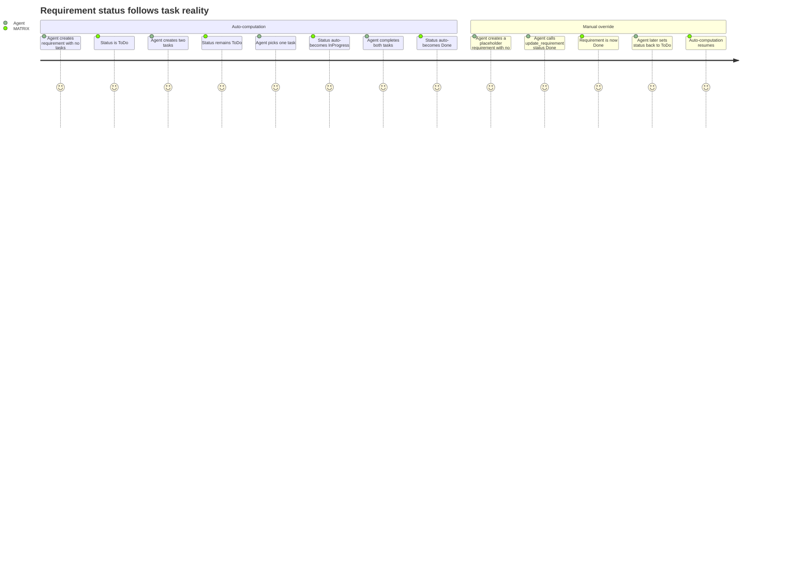

# REQ-006: Requirement Status Computation

**Status:** Done
**Priority:** P0
**Created:** 2026-04-29
**Updated:** 2026-04-29

## Functional

Depends on: REQ-002, REQ-003, REQ-004

## What

A requirement's status is automatically derived from its tasks' statuses according to these rules:

| Condition                                             | Computed Status |
| ----------------------------------------------------- | --------------- |
| All tasks are `"Done"` (and at least one task exists) | `"Done"`        |
| Any task is `"InProgress"`                            | `"InProgress"`  |
| Otherwise (all tasks ToDo, or no tasks exist)         | `"ToDo"`        |

### Manual override

- An agent can set status to `"Done"` via `update_requirement` — useful for closing a requirement that has no tasks (placeholder/high-level req) or force-closing.
- An agent can set status to `"ToDo"` via `update_requirement` — this resumes auto-computation on subsequent task changes.
- Setting status to `"InProgress"` manually is always rejected — it is exclusively auto-computed.

### Recomputation triggers

Status is recomputed automatically after any operation that changes a task's status:

- `pick_task` (Open → In Progress)
- `complete_task` (In Progress → Done)
- `release_task` (In Progress → Open)
- `force_release_task` (In Progress → Open) — see REQ-010

After a manual override to `"Done"`, auto-computation is suppressed. After a manual override to `"Open"`, auto-computation resumes.

## Why

Agents shouldn't have to manually track whether a requirement is complete — that's error-prone and creates drift between task reality and requirement status. Auto-computation keeps the status truthful at all times. Manual override handles edge cases: placeholder requirements with no tasks, or situations where an agent knows the requirement is satisfied despite task-level nuance.

## User Journey

## Definition of Done

- [x] A requirement with no tasks has status `"ToDo"` by default
- [x] A requirement auto-transitions to `"InProgress"` when any of its tasks becomes `"InProgress"`
- [x] A requirement auto-transitions to `"Done"` when ALL of its tasks are `"Done"` and at least one task exists
- [x] A requirement auto-transitions to `"ToDo"` when it has tasks but none are `"InProgress"` and not all are `"Done"`
- [x] Recomputation triggers after `pick_task`, `complete_task`, `release_task`, and `force_release_task`
- [x] `update_requirement` allows setting status to `"Done"` (manual override — suppresses auto-computation)
- [x] `update_requirement` allows setting status to `"ToDo"` (resumes auto-computation)
- [x] `update_requirement` rejects setting status to `"InProgress"`
- [x] After manual override to `"Done"`, task status changes do NOT revert the requirement status (the override sticks until explicitly changed)
- [x] After manual override to `"ToDo"`, subsequent task status changes trigger normal auto-computation

## Open Questions

- When a requirement is manually set to `"Done"` and then a new task is created under it, should the status automatically revert to `"ToDo"`? **Recommendation:** Yes — creating a task signals the requirement is not actually done, so auto-computation should resume.

## Notes

- The "manual override sticks" behaviour means: if an agent manually closes a req, and then another agent completes/releases tasks under it, the Done status is preserved. This prevents accidental reopening. But creating a _new_ task under a closed req should reopen it (see Open Question).
