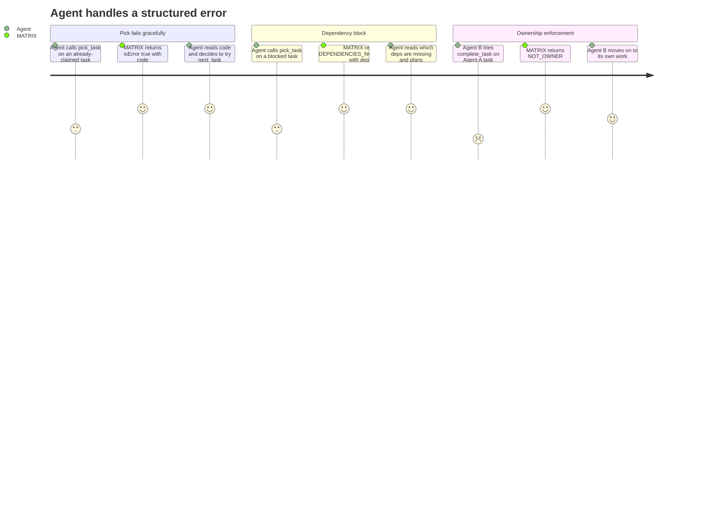

# REQ-007: Structured Error Responses

**Status:** Done
**Priority:** P0
**Created:** 2026-04-29
**Updated:** 2026-04-29

## Non-Functional

## What

All tool errors are returned as MCP-compliant error responses (`isError: true`) with a structured payload containing:

- **code** — a machine-readable string that agents can switch on programmatically
- **message** — a human-readable description with enough context to diagnose the issue

### Error code catalog

| Code                         | When                                                                                                          | Used by                                                      |
| ---------------------------- | ------------------------------------------------------------------------------------------------------------- | ------------------------------------------------------------ |
| `NOT_FOUND`                  | Requested entity does not exist                                                                               | get_requirement, get_task, and any tool referencing an ID    |
| `INVALID_INPUT`              | Input validation failed (missing required field, wrong type, value out of range)                              | All tools (returned by MCP SDK layer, not application code)  |
| `TASK_NOT_OPEN`              | Tried to pick a task that is not `"ToDo"`                                                                     | pick_task                                                    |
| `TASK_NOT_IN_PROGRESS`       | complete/release/force_release: task is not InProgress. Also: delete_task: task IS InProgress (release first) | complete_task, release_task, force_release_task, delete_task |
| `NOT_OWNER`                  | agent_id does not match the task's `assigned_to`                                                              | complete_task, release_task                                  |
| `DEPENDENCIES_NOT_SATISFIED` | One or more dependency reqs/tasks are not `"Done"`                                                            | pick_task                                                    |
| `CIRCULAR_DEPENDENCY`        | Adding the dependency would create a cycle                                                                    | create/update requirement, create/update task                |
| `INVALID_DEPENDENCY`         | Dependency references a non-existent ID or a task in a different requirement                                  | create/update requirement, create/update task                |
| `DUPLICATE_DEPENDENCY`       | Same ID appears more than once in the dependencies array                                                      | create/update requirement, create/update task                |
| `INVALID_STATUS`             | Tried to manually set requirement status to `"In Progress"`                                                   | update_requirement                                           |
| `HAS_DEPENDENTS`             | Tried to delete an entity that other entities depend on (P1 — see REQ-011)                                    | delete_requirement, delete_task                              |

## Why

Agents need to programmatically handle different error conditions. A `TASK_NOT_OPEN` error means "try a different task" — a very different recovery action from `DEPENDENCIES_NOT_SATISFIED` which means "work on the dependency first." Human-readable messages alone force agents to parse free text, which is fragile. Structured codes enable reliable, deterministic error handling.

## User Journey

## Definition of Done

- [x] All error responses set MCP `isError: true`
- [x] Error response content includes a `code` field (string) from the defined catalog
- [x] Error response content includes a `message` field (string) with human-readable context
- [x] `message` includes relevant IDs (e.g. "Task tsk-00003 is not ToDo, current status: InProgress")
- [x] Every tool returns the appropriate error code(s) for its documented failure conditions
- [x] No tool ever returns a generic/unstructured error for a known failure condition
- [x] `INVALID_INPUT` is surfaced by the MCP SDK Zod validation layer before handlers run; it does not need to be thrown by application code
- [x] Success responses do NOT include error fields
- [x] Error codes are included in the MCP server instructions so agents can reference them

## Open Questions

None.

## Notes

- Error codes should be stable — once shipped, they become part of the API contract. Adding new codes is fine; renaming or removing existing codes is a breaking change.
- The `HAS_DEPENDENTS` code is reserved for REQ-011 (Deletion Tools) and does not need to be implemented until P1.
