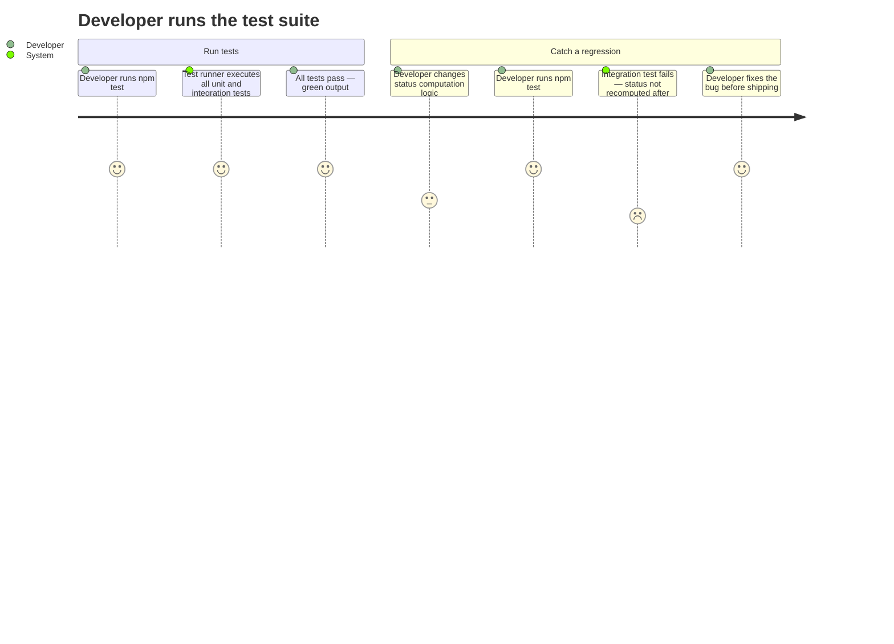

# REQ-008: Automated Testing

**Status:** Done
**Priority:** P0
**Created:** 2026-04-29
**Updated:** 2026-05-01

## Non-Functional

## What

The system has two layers of automated tests:

1. **Unit tests** — Test the persistence/data layer in isolation: ID generation, dependency cycle detection, status computation logic, and all CRUD operations.
2. **Integration tests** — Test each MCP tool end-to-end: valid inputs, invalid inputs, error codes, and multi-step workflows (create req → create tasks → pick → complete → verify req status auto-computation).

All tests run with a single command and produce clear pass/fail output.

## Why

MATRIX's correctness is critical — agents rely on it for coordination. Locking, dependency enforcement, status computation, and concurrent access have subtle edge cases that manual testing cannot reliably catch. If `pick_task` fails to check dependencies, agents start work on unfinished prerequisites. If status computation has a bug, the backlog misrepresents reality. Automated tests are the safety net.

## User Journey

## Definition of Done

- [x] Unit tests cover: sequential ID generation (no reuse after deletion)
- [x] Unit tests cover: dependency cycle detection (direct and transitive cycles, for both reqs and tasks)
- [x] Unit tests cover: requirement status computation (all state combinations: ToDo, InProgress, Done, status_locked suppression)
- [x] Unit tests cover: all CRUD operations at the data layer (create, read, update, list)
- [x] Integration tests cover: every MCP tool with valid inputs (returns expected result)
- [x] Integration tests cover: every MCP tool with invalid inputs (returns correct error code)
- [x] Integration tests cover: multi-step workflow — create req → create tasks with dependencies → pick in correct order → complete → verify req status transitions
- [x] Integration tests cover: ownership enforcement — agent B cannot complete agent A's task
- [x] Integration tests cover: dependency blocking — pick_task fails when deps not satisfied
- [x] Tests use an in-memory or temporary database (not the production DB path)
- [x] All tests run via `npm test`
- [x] Test output clearly shows pass/fail with failure details

## Open Questions

- Which test runner to use is an implementation choice. The requirement is that `npm test` works.

## Notes

- Tests should be added incrementally alongside each functional requirement, not as a big-bang effort at the end. The DoD for this requirement is met when coverage across all P0 functional requirements is achieved.
- 112 tests total across 6 test files
