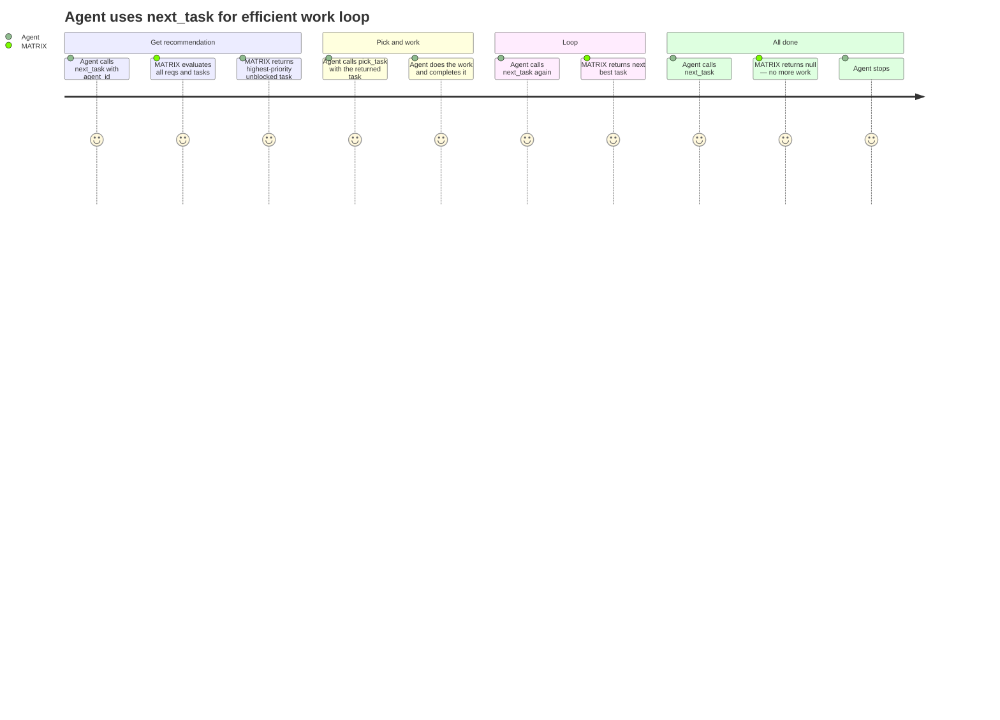

# REQ-009: Smart Task Recommendation

**Status:** Done
**Priority:** P1
**Created:** 2026-04-29
**Updated:** 2026-04-29

## Functional

Depends on: REQ-004, REQ-005

## What

Agents can call `next_task(agent_id)` to get the best available task to work on, without manually surveying the backlog.

### Selection algorithm

1. Consider only requirements whose dependency reqs are ALL `"Done"` (unblocked) and whose own status is NOT `"Done"`.
2. Sort those requirements by priority ascending (1 = highest priority first).
3. Within each requirement (in priority order), find tasks with status `"ToDo"` whose dependency tasks are ALL `"Done"`.
4. Return the first eligible task found.
5. Return null if no eligible task exists.

### Parameters

- `agent_id` — required. Identifies the calling agent (for potential future use in affinity/load-balancing; not used in v1 selection logic).

## Why

Agents working through a backlog shouldn't have to call `list_requirements` → iterate → `list_tasks` → check dependencies → pick one. That's a multi-step overhead on every work cycle. `next_task` reduces it to a single call, and it gets the prioritisation right every time — ensuring the highest-value unblocked work gets done first.

## User Journey

## Definition of Done

- [x] `next_task` accepts agent_id (required) and returns the single best eligible task, or null
- [x] Only considers requirements whose dependency requirements are all `"Done"`
- [x] Excludes requirements with status `"Done"`
- [x] Sorts by requirement priority ascending (1 first)
- [x] Only considers tasks with status `"ToDo"`
- [x] Within a requirement, only considers tasks whose dependency tasks are all `"Done"`
- [x] Returns null when no eligible tasks exist (all work is done or blocked)
- [x] Registered as an MCP tool with Zod-validated input schema

## Open Questions

- Should `next_task` skip tasks in requirements that are manually overridden to `"Done"`? **Recommendation:** Yes — a manually closed requirement means "this work is finished," so its tasks should not be recommended.

## Notes

- The `agent_id` parameter is included for future extensibility (e.g. agent affinity, load balancing) but has no effect on the selection algorithm in v1.
- This is a read-only operation — it does not change any state. The agent must still call `pick_task` to claim the returned task.
