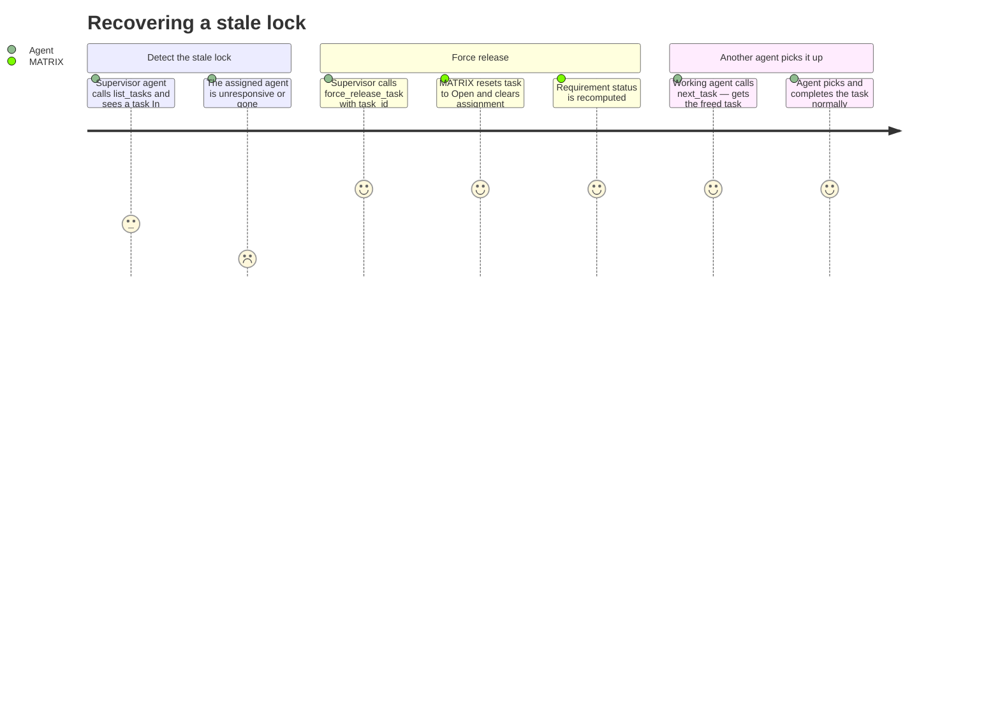

# REQ-010: Admin Task Recovery

**Status:** Done
**Priority:** P1
**Created:** 2026-04-29
**Updated:** 2026-04-29

## Functional

Depends on: REQ-004

## What

An admin-level tool `force_release_task(task_id)` that forces any `"In Progress"` task back to `"Open"`, regardless of which agent currently owns it. No `agent_id` is required. This is the recovery mechanism for stale locks caused by crashed agents.

### Behaviour

- Sets task status to `"ToDo"` and clears `assigned_to`.
- Fails if the task is not `"InProgress"` (nothing to force-release).
- Triggers requirement status recomputation (since a task changed status).

## Why

In multi-agent workflows, agents can crash, disconnect, or timeout without calling `release_task`. Without a recovery mechanism, those tasks are stuck in `"In Progress"` forever — no other agent can pick them up, and the requirement can never complete. `force_release_task` is the escape hatch that keeps the system from getting permanently stuck.

## User Journey

## Definition of Done

- [x] `force_release_task` accepts task_id (required) — no agent_id parameter
- [x] Sets task status to `"ToDo"` and clears `assigned_to` to null
- [x] Works regardless of which agent_id is currently assigned
- [x] Fails with `TASK_NOT_IN_PROGRESS` if the task is not `"InProgress"`
- [x] Triggers requirement status recomputation after releasing
- [x] Returns the updated full task object
- [x] Registered as an MCP tool with Zod-validated input schema

## Open Questions

None.

## Notes

- This is intentionally a blunt instrument — any caller can force-release any task. In a local, trusted environment this is acceptable. If MATRIX is ever deployed in a shared/untrusted context, this tool would need access controls.
- There is no automatic timeout-based release. Stale lock detection and recovery is a manual/supervisory action. This keeps the system simple and predictable.
