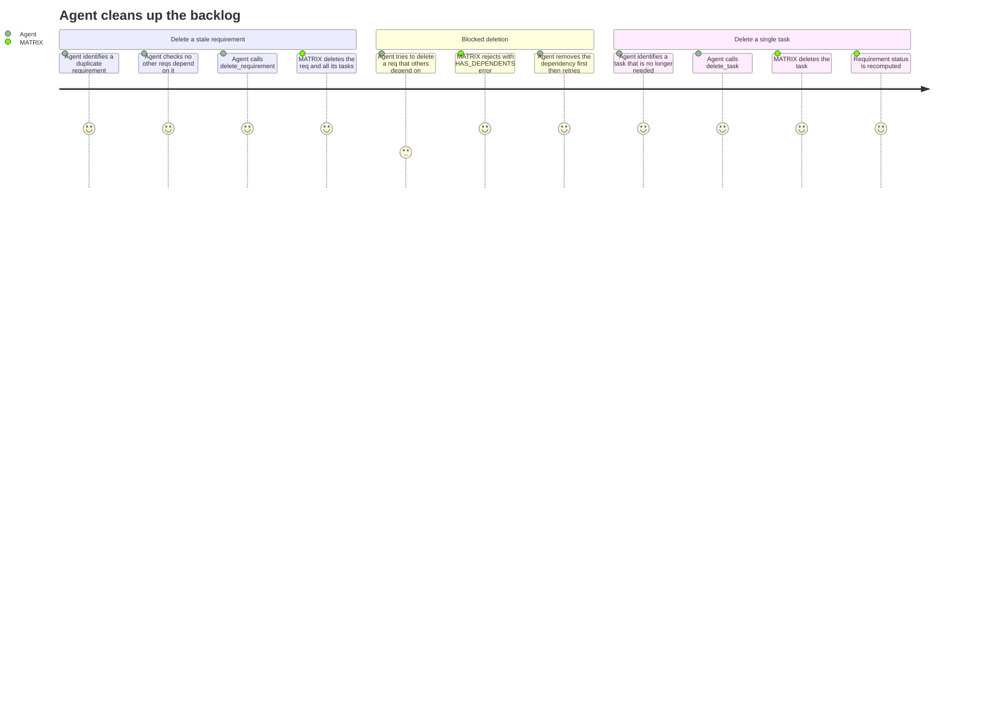

# REQ-011: Deletion Tools

**Status:** Done
**Priority:** P1
**Created:** 2026-04-29
**Updated:** 2026-04-29

## Functional

Depends on: REQ-002, REQ-003

## What

Two MCP tools for permanently removing entities:

**delete_requirement(req_id)**

- Permanently deletes the requirement AND all of its child tasks.
- Fails if any other requirement depends on this one (`HAS_DEPENDENTS` error). The caller must remove the dependency first.

**delete_task(task_id)**

- Permanently deletes a single task.
- Fails if any other task within the same requirement depends on this one (`HAS_DEPENDENTS` error). The caller must remove the dependency first.

Both operations are irreversible.

## Why

Over the course of a project, requirements and tasks get created that turn out to be duplicates, mistakes, or no longer relevant. Without deletion, the backlog accumulates noise — agents waste time reading and evaluating stale items, and progress metrics become inaccurate. Deletion keeps the backlog clean and focused.

## User Journey

## Definition of Done

- [x] `delete_requirement` permanently removes the requirement AND ALL its child tasks (cascade)
- [x] `delete_requirement` fails with `HAS_DEPENDENTS` if any other requirement lists this req in its dependencies
- [x] `delete_requirement` fails with `NOT_FOUND` if the req does not exist
- [x] `delete_task` permanently removes a single task
- [x] `delete_task` fails with `HAS_DEPENDENTS` if any other task (within the same requirement) lists this task in its dependencies
- [x] `delete_task` fails with `NOT_FOUND` if the task does not exist
- [x] `delete_task` fails with `TASK_NOT_IN_PROGRESS` if the task is currently `"InProgress"` (defensive guard)
- [x] Deleting a task triggers requirement status recomputation
- [x] Deleted IDs are never reused (sequential counter does not reset)
- [x] Both tools return the full deleted object (Requirement / Task) including ID, title, and all other fields
- [x] Both tools are registered as MCP tools with Zod-validated input schemas

## Open Questions

- Should deletion be allowed on `"In Progress"` tasks? **Recommendation:** No — force-release or complete the task first. Deleting in-progress work without the owning agent's knowledge could cause confusion. Reject with a clear error.

## Notes

- `delete_requirement` cascade-deletes all child tasks automatically. This is the preferred UX — callers should not need to manually delete tasks before removing a requirement.
- Deletion of `"InProgress"` tasks is rejected (`TASK_NOT_IN_PROGRESS`) — force-release or complete the task first. This prevents accidental loss of in-progress work.
- `delete_task` still uses HAS_DEPENDENTS (not cascade) because task dependencies carry semantic meaning about work ordering within the requirement. Removing a dependency should be a deliberate action.
