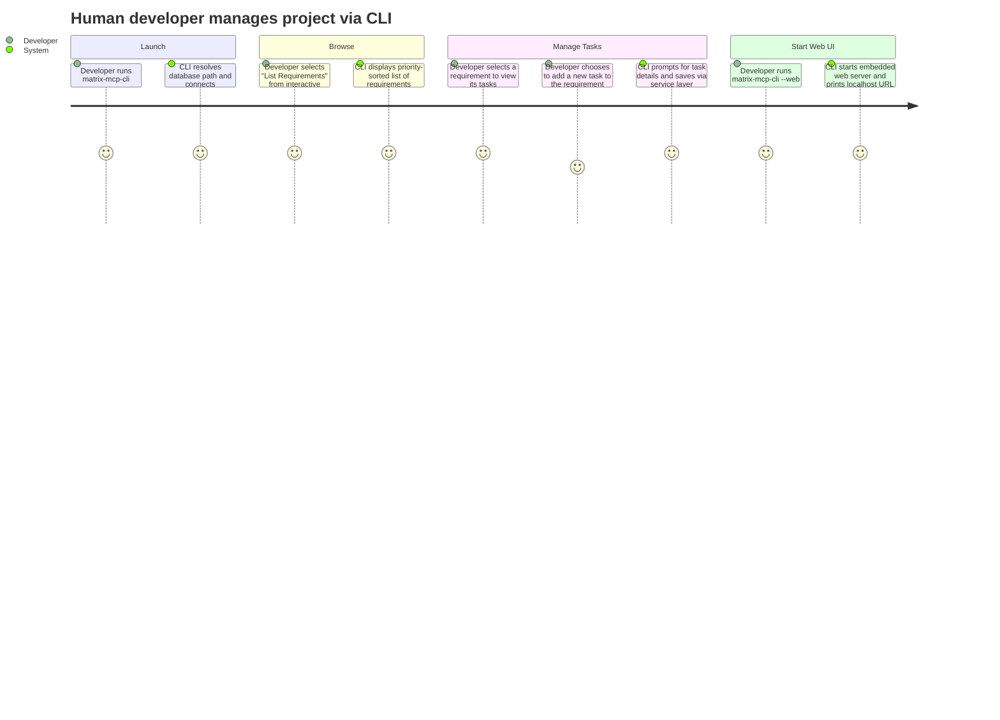

# REQ-012: CLI Interface

**Status:** Done
**Priority:** P1
**Created:** 2026-05-01
**Updated:** 2026-05-01

## Functional

## What

Human developers can interact with the MATRIX database via an interactive Command Line Interface (CLI). The CLI provides menus and sub-commands to view, create, update, and delete requirements and tasks, as well as perform workflow operations (pick, complete, release). It also serves as the launch point for the Web Interface.

## Why

Currently, MATRIX is an MCP server designed for AI agents. Human developers occasionally need to inspect the status of requirements, add new ones, or manually move a task's state without needing to write a script or use an MCP inspector client. A CLI tool bridges this gap, making MATRIX a usable local project management tool for humans.

## User Journey

## Definition of Done

- [x] A new executable script is created in `src/interface/` (e.g., `src/interface/cli.js`) and registered in `package.json` under `bin`.
- [ ] Database resolution matches the existing server: `--matrix-db-path` CLI arg > `MATRIX_DB_PATH` env var > `.matrix/matrix.db` in current directory.
- [ ] The CLI provides interactive menus (e.g., using `inquirer` or simple prompts) for listing, creating, updating, and deleting requirements and tasks.
- [ ] The CLI supports executing workflow actions: pick, complete, release, and force release task.
- [ ] The CLI includes a command or flag to start the embedded web interface (e.g., `matrix-mcp-cli web` or `matrix-mcp-cli --web`).
- [ ] All database mutations and queries strictly use the existing service layer (`src/requirements.js`, `src/tasks.js`, `src/task-workflow.js`), not raw SQL queries.
- [x] All new code for the CLI resides strictly within the `src/interface/` folder.

## Dependencies

- **REQ-001**: Relies on data persistence and configuration.
- **REQ-002**, **REQ-003**, **REQ-004**, **REQ-011**: Leverages the service functions for managing requirements and tasks.

## Open Questions

- What should be the exact published binary name? `matrix-mcp-cli` or `matrix-cli`?

## Notes

- Keep it simple and practical. Well-maintained external libraries like `commander`, `inquirer`, or `chalk` are acceptable and encouraged to avoid reinventing the wheel.
- No enterprise framework or unnecessary complexity should be introduced for this wrapper.
