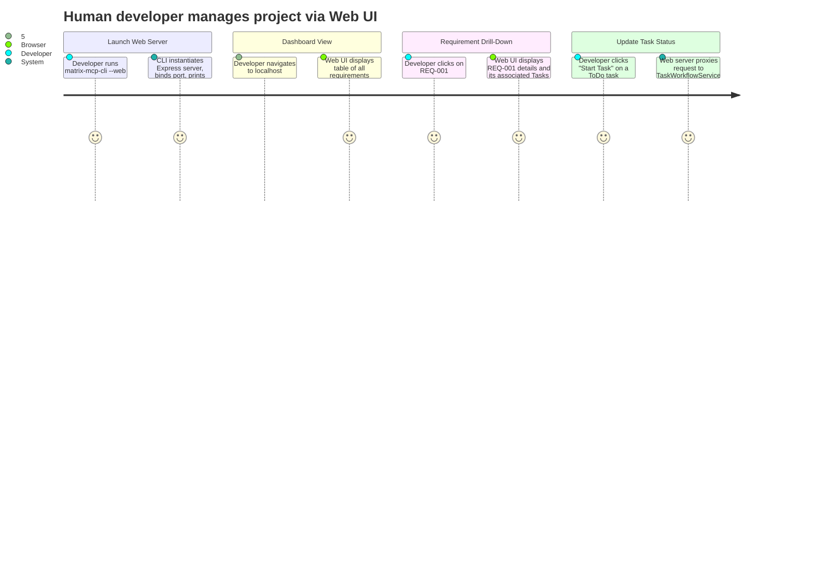

# REQ-013: Web Interface

**Status:** Done
**Priority:** P1
**Created:** 2026-05-01
**Updated:** 2026-05-01

## Functional

## What

An embedded, minimal Web Interface that allows human users to easily browse and manage the project's requirements and tasks using a graphical browser interface. The web server is launched strictly via the CLI tool (see REQ-012) and does not require a standalone daemon. All display and interaction happen over standard HTTP.

## Why

While an interactive CLI (REQ-012) is useful for quick edits from the terminal, a Web UI provides a far better at-a-glance view of the entire project state. A graphical interface can present requirements, their nested tasks, current statuses, and dependencies much clearer than terminal output, making project tracking and oversight simple and intuitive. By not requiring a complex build pipeline, the tool adds no overhead for the user.

## User Journey

## Definition of Done

- [x] A simple HTTP server (e.g., Express) is created in `src/interface/` and can be launched via the CLI's web subcommand.
- [ ] The application provides a minimal, functional graphical UI to list all requirements, and list all tasks under a given requirement.
- [ ] The application supports HTML forms/buttons for creating, updating, and deleting requirements and tasks.
- [ ] The application supports workflow actions: pick, complete, and release tasks via proper endpoints.
- [ ] No frontend build pipeline is introduced (e.g., no React/Vue/Svelte build steps); uses Server-Side Rendering (SSR) or direct vanilla HTML/JS/CSS served statically.
- [ ] All database queries and mutations in the Web UI strictly leverage the existing service layer (`requirements.js`, `tasks.js`, `task-workflow.js`), avoiding raw SQL queries.
- [ ] UI is practical, readable, and functional. No enterprise-grade styling or CSS frameworks required, but a clean, simple styling (like standard HTML or minimal CSS classless library) is preferred.
- [x] All code for the Web UI resides strictly within the `src/interface/` folder.

## Dependencies

- **REQ-012**: Requires the CLI to launch the web server and resolve the database path.
- **REQ-001** to **REQ-011**: Leverages the service layer exactly like the current MCP server and CLI.

## Open Questions

- What port should the embedded server default to, and how should it handle port conflicts?
- What lightweight SSR engine or templating (e.g., EJS, Handlebars) is preferred for rendering, or should it just be vanilla HTML strings?

## Notes

- The goal is a highly readable UI without overhead.
- No direct database access or new database patterns. Use the `DatabaseSync` connection provided by the core engine and pass it properly to the existing services.
